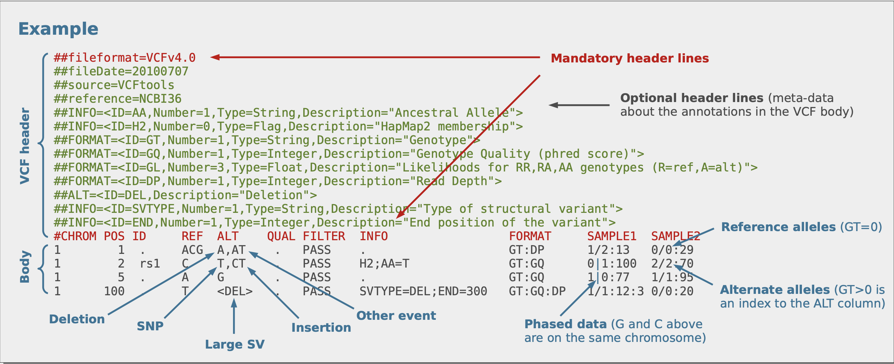

```{r setup, include=FALSE}
knitr::opts_chunk$set(echo = FALSE)
```
For this rstats club we will be going through how to use the variant annotation package to wrangle and annotate a vcf file. This is a common request of investigators and can be a valuable tool in genotype based studies.
```{r library, echo=FALSE}
### Tempus coding challenge
##Load packages
library(VariantAnnotation)
library(here)
library(BSgenome.Hsapiens.UCSC.hg19)
library(TxDb.Hsapiens.UCSC.hg19.knownGene)
```
Below we can use the `readVCF()` function to read in our sample dataset below.
```{r readVCF, echo=TRUE}
##read vcf file into GRanges object 
vcf <- readVcf("Challenge_data_(1).vcf", "hg19")
```
After we've read in the data it's probably a good time to refresh on the structure of a vcf file and the `vcf` object in our R environment.

And below is the structure of our R object
```{r strVCF, echo=TRUE}
vcf
```
```{r MakeANN, echo=TRUE}
## 0. set up annotation dataframe
ann <- as.data.frame(ranges(vcf))
```
```{r GetTYPE, echo=TRUE}
#Determine type of variation 
for(i in 1:length(ranges(vcf))){
  ann$var.type <-  unlist(vcf@info$TYPE[[i]][1])
}
```
```{r GetEffect, echo=TRUE}
#Effect of variation (missence (changes the amino acid), silent (doesn't change amino acid), intergenic)
txdb <- TxDb.Hsapiens.UCSC.hg19.knownGene
seqlevels(vcf)[1:25] <- paste0("chr",seqlevels(vcf))
common.seq.levels <- intersect(seqlevels(vcf), seqlevels(txdb))
vcf <- keepSeqlevels(vcf, common.seq.levels, pruning.mode="coarse")
txbd <- keepSeqlevels(txdb, common.seq.levels, pruning.mode="coarse")
coding <- predictCoding(vcf, txdb, seqSource=Hsapiens) #compute amino acid changes
ann$frameshift <- FALSE
ann$missence <- FALSE
ann$silent <- FALSE
```
```{r GetIndices, echo=TRUE}
for (i in 1:length(ranges(vcf))){
  indices = which(ranges(coding) == ranges(vcf)[i])
  if(length(indices) == 0){
    next
  }
  for (j in 1:length(indices)){
    index = indices[j] #index = indices[1]
    if(toString(coding$VARAA[index])==""){
      ann$frameshift[i] = TRUE
    }
    else if (toString(coding$VARAA[index])!=toString(coding$REFAA[index])){
      ann$missence[i] =TRUE
    }
    else if (toString(coding$VARAA[index])==toString(coding$REFAA[index])){
      ann$silent[i] =TRUE
    }
    
  }
}
``` 
 
```{r GetVarEffect, echo=TRUE}
ann$var.effect <- NA
for(i in 1:nrow(ann)){
  if(ann$frameshift[i]==TRUE){
    ann$var.effect[i] <- "frameshift"
    next
  }
  if(ann$missence[i]==TRUE){
    ann$var.effect[i] <- "missence"
    next
  }
  if (ann$silent[i]==TRUE){
    ann$var.effect[i] <- "silent"
    next
  }
  else{
    ann$var.effect[i] <- "unknown"
  }
    
}
```
```{r GetDepth, echo=TRUE}
## 2. Depth of sequence coverage at the site of variation
ann$depth <- vcf@info$DP
```
```{r GetDPRA, echo=TRUE}
## 3. Number of reads supporting the variant.
# DRPA is this ratio of depths such that ALT Depth:REF Depth and is presented as a decimal so
# DPRA = ALT Depth / REF Depth for a given variant. To find the number of reads supporting the ALT variant we must 
# solve the following equation DPRA = ALT / (DP - ALT) for ALT. ALT = (DPRA * DP) / (1 + DPRA)
dpra <- numeric()
for(i in 1:length(ranges(vcf))){
  dpra[i] <-  vcf@info$DPRA[[i]][1]
}
dpra <-unlist(dpra)
ann <- cbind(ann,dpra)
ann$var.num <- ann$dpra* vcf@info$DP / (1 + ann$dpra)
```
```{r GetPercentVar,echo=TRUE}
# percentage of reads supporting Variant
ann$percent.var <- ann$var.num/ann$depth
#percentage of reads supporting ref
ann$percent.ref <- (ann$depth - ann$var.num)/ann$depth
## 5. 
## 6. Percent reads of ref on forward strand.
# first calculate number of reads supporting ref
ann$ref.num <- vcf@info$DP/(dpra +1)
#calculate percent of reference reads on forward strand
ann$perc.ref.for <- vcf@info$SRF/ann$ref.num
write.csv(ann,here::here("annotations.csv"), row.names = TRUE)
```